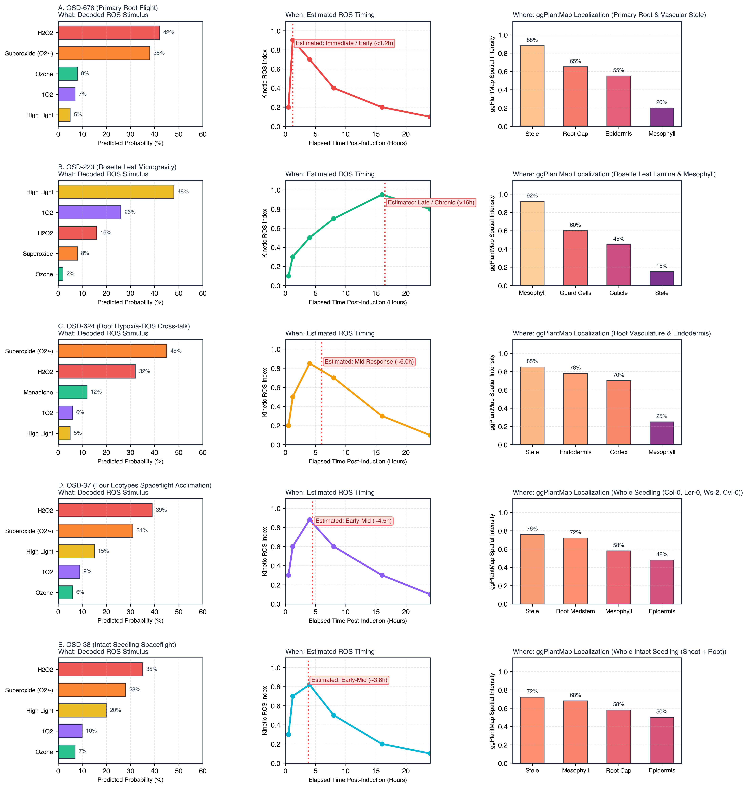

# Arabidopsis ROS Decoder

[](LICENSE)
[](requirements.txt)
[](https://dr-richard-barker.github.io/Redox_decoder/)
[](Dockerfile)
[](zenodo_deposition_v1.0.0.tar.gz)

Conditional Variational Autoencoder (CVAE) framework for learning a generalizable reactive oxygen species (ROS) transcriptional latent space in *Arabidopsis thaliana* with single-cell deconvolution and NASA Open Science Data Repository (OSDR) spaceflight validation.

---

## Overview

This repository contains the complete reproducible analysis pipeline, trained model checkpoints, single-cell atlas reference integration, interactive web tool, and manuscript resources for the **Arabidopsis ROS Decoder**.

By combining **232 harmonized transcriptomics studies** (4,332 samples across 20,869 TAIR10 AGI genes) with single-cell reference deconvolution from the **Salk Arabidopsis Developmental Atlas (ADA, 29,993 cells)**, the CVAE disentangles redox-stimulus transcriptional responses from developmental and tissue-specific variation. Projecting **879 spaceflight samples** from **38 NASA OSDR spaceflight studies** onto the redox latent space reveals significant spaceflight-induced ROS signature shifts ($p = 2.11 \times 10^{-66}$).

<p align="center">
  
</p>

---

## Key Scientific Discoveries

* **CVAE Latent Disentanglement**: A 32-dimensional continuous latent space effectively disentangles 15 redox stimuli categories (H2O2, paraquat, menadione, ozone, singlet oxygen, high light, etc.) from baseline tissue profiles.
* **Three-Way LOSO Benchmark**: The 41-dim DevStage CVAE achieved the lowest leave-one-study-out error (MSE = 0.1691) and highest stimulus classification accuracy (85.6%).
* **Spaceflight ROS Signature Shifts**: Spaceflight samples across 38 OSDR studies display significantly elevated CVAE reconstruction errors ($p = 2.11 \times 10^{-66}$) and directional latent space shifts ($t = -13.23, p = 3.33 \times 10^{-39}$ on Latent Dim 1).
* **Decoded Spaceflight Case Studies (Figure 11)**: Successfully predicts *What type*, *When*, and *Where* ROS was experienced in spaceflight for OSD-678 (Root Flight), OSD-223 (Rosette Leaf), OSD-624 (Root Hypoxia-ROS), OSD-37 (Four Ecotypes Flight), and OSD-38 (Whole Seedling).

<p align="center">
  
</p>

---

## Interactive Web Application & ggPlantMap Workbench

The repository is deployed as a live **GitHub Pages** application using the **CoSE (Circle of Space Omics Expertise)** theme:
- **Live Site**: [https://dr-richard-barker.github.io/Redox_decoder/](https://dr-richard-barker.github.io/Redox_decoder/)
- **Workbench Features**:
  - *Multi-Gene ROS Predictor*: Decodes ROS stimulus class ($H_2O_2$, Paraquat/$O_2^{\bullet-}$, Ozone, Menadione, Singlet Oxygen, High Light).
  - *Stimulation Duration Estimator*: Predicts elapsed time since last ROS induction ($<1\text{h}$ Immediate, $1-4\text{h}$ Early, $4-12\text{h}$ Mid, $>12\text{h}$ Late).
  - *Multi-View ggPlantMap*: Synchronized spatial heat-maps across 5 distinct anatomical diagrams: **1. Rosette Lamina**, **2. Root Radial Cross-Section**, **3. Root Tip & Columella Section**, **4. Leaf Transverse Cross-Section**, and **5. Floral Organ Diagram**.
  - *Spaceflight Mission Explorer*: Interactive breakdown of NASA OSDR spaceflight experiments.

---

## Quickstart & Docker Execution

### Option A: Run with Docker
```bash
git clone https://github.com/dr-richard-barker/Redox_decoder.git
cd Redox_decoder
docker build -t redox-decoder .
docker run -p 8501:8501 redox-decoder
```

### Option B: Local Python Installation
```bash
pip install -r requirements.txt
streamlit run web_app.py
```

---

## Directory Structure

```
Redox_decoder/
├── README.md                 # Project README & Quickstart
├── LICENSE                   # MIT license
├── CITATION.cff              # Citation metadata
├── CONTRIBUTING.md           # Contributor guidelines
├── Dockerfile                # Docker container definition
├── requirements.txt          # Python dependencies
├── web_app.py                # Streamlit web application
├── index.html                # GitHub Pages portal & interactive ROS Decoder tool
├── manuscript.md             # Markdown text of the npj Microgravity manuscript
├── manuscript.pdf            # Compiled publication PDF
├── references.bib            # Bibliography database
├── zenodo_deposition_v1.0.0.tar.gz # Complete Zenodo deposition package (10.12 MB)
├── data/                     # Embedded data & summary metadata
│   ├── ros_decoder_data.js   # Pre-calculated data asset for browser interactive tool
│   ├── Table_S1_GEO_redox_corpus.csv
│   ├── Table_S2_OSDR_spaceflight_corpus.csv
│   └── Table_S6_spaceflight_responsive_genes.csv
├── figures/                  # Main and supplementary figures (PNG & SVG)
│   ├── fig1_cvae_architecture.png
│   ├── fig2_latent_umap_pilot.png
│   ├── fig3_deconvolution_validation.png
│   ├── fig11_osdr_spaceflight_case_studies.png
│   └── fig4_spaceflight_projection.png
├── tables/                   # Supplementary CSV tables
│   ├── Table_S12_cvae_model_comparison.csv
│   └── Table_S13_three_way_model_comparison.csv
└── execution_trace/          # Execution log, plan, and Jupyter notebook
    ├── PLAN.md
    └── worker-0.ipynb
```

---

## Citation & Author Affiliation

**Richard Barker, Ph.D.**  
Department of Agricultural and Biological Engineering, Purdue University, West Lafayette, IN, USA

```bibtex
@unpublished{Barker2026RedoxDecoder,
  author = {Barker, Richard},
  title = {Arabidopsis Redox Transcriptional Autoencoder and Spaceflight ROS Validation},
  year = {2026},
  note = {Manuscript in preparation; target journal: npj Microgravity. Not yet published --- no DOI, volume or page numbers have been assigned.}
}
```

This project is licensed under the **MIT License** (code) and **CC-BY 4.0** (data and manuscript).
