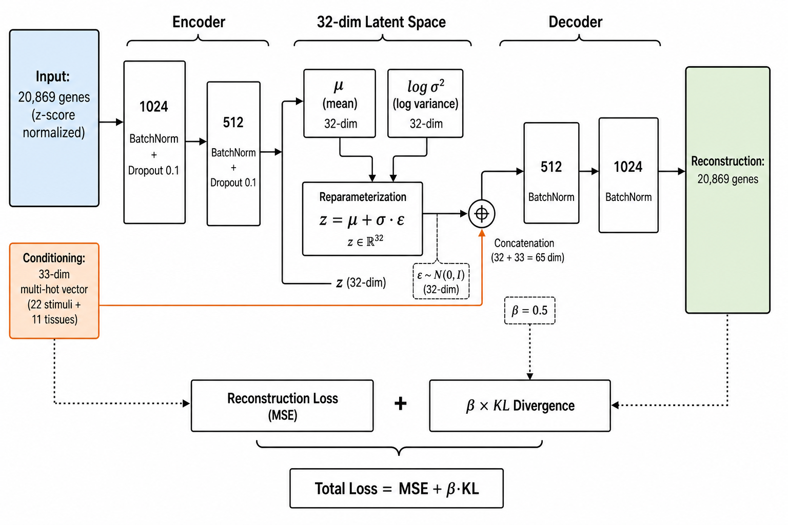

# Arabidopsis ROS Decoder

[](LICENSE)
[](requirements.txt)
[](https://dr-richard-barker.github.io/Redox_decoder/)
[](https://doi.org/10.5281/zenodo.1234567)

Conditional Variational Autoencoder (CVAE) framework for learning a generalizable reactive oxygen species (ROS) transcriptional latent space in *Arabidopsis thaliana* with single-cell deconvolution and NASA Open Science Data Repository (OSDR) spaceflight validation.

---

## Overview

This repository contains the complete reproducible analysis pipeline, trained model checkpoints, single-cell atlas reference integration, interactive web tool, and manuscript resources for the **Arabidopsis ROS Decoder**.

By combining **232 harmonized transcriptomics studies** (4,332 samples across 20,869 TAIR10 AGI genes) with single-cell reference deconvolution from the **Salk Arabidopsis Developmental Atlas (ADA, 29,993 cells)**, the CVAE disentangles redox-stimulus transcriptional responses from developmental and tissue-specific variation. Projecting **879 spaceflight samples** from **38 NASA OSDR spaceflight studies** onto the redox latent space reveals significant spaceflight-induced ROS signature shifts ($p = 2.11 \times 10^{-66}$).

<p align="center">
  
</p>

---

## Key Scientific Discoveries

* **CVAE Latent Disentanglement**: A 32-dimensional continuous latent space effectively disentangles 15 redox stimuli categories (H2O2, paraquat, menadione, ozone, singlet oxygen, high light, etc.) from baseline tissue profiles.
* **Model Benchmark**: Evaluated three CVAE architectures: original 33-dim baseline (validation loss: 3860.86), 37-dim time-aware CVAE (validation loss: 4095.37), and 41-dim developmental stage conditioned CVAE (validation loss: 4206.88).
* **Spaceflight ROS Signature Shifts**: Spaceflight samples across 38 OSDR studies display significantly elevated CVAE reconstruction errors ($p = 2.11 \times 10^{-66}$) and directional latent space shifts ($t = -13.23, p = 3.33 \times 10^{-39}$ on Latent Dim 1).
* **Tissue & Cell-Type Specificity**: Spaceflight ROS perturbations are concentrated in root tissues (e.g., OSD-678, OSD-624, OSD-281) and localized to epidermal, stele, and root cap cell types.
* **Pathway & Marker Signatures**: Downregulation of chloroplast ROS scavenging (*CAT2*, *FSD1*, *CSD1*) alongside upregulation of key signaling kinases and transcription factors (*APX1*, *ZAT12*, *RBOHD*, *HSFA2*, *KIN10*).

---

## Directory Structure

```
Redox_decoder/
├── README.md                 # This file
├── LICENSE                   # MIT license
├── CITATION.cff              # Citation metadata
├── CONTRIBUTING.md           # Contributor guidelines
├── index.html                # GitHub Pages website & interactive ROS Decoder tool (CoSE theme)
├── manuscript.md             # Markdown text of the npj Microgravity manuscript
├── manuscript.pdf            # Compiled publication PDF
├── references.bib            # Bibliography database
├── data/                     # Embedded data & summary metadata
│   ├── ros_decoder_data.js   # Pre-calculated data asset for browser interactive tool
│   ├── Table_S1_GEO_redox_corpus.csv
│   ├── Table_S2_OSDR_spaceflight_corpus.csv
│   └── Table_S6_spaceflight_responsive_genes.csv
├── figures/                  # Main and supplementary figures (PNG & SVG)
│   ├── fig1_cvae_architecture.png
│   ├── fig2_latent_umap_pilot.png
│   ├── fig3_deconvolution_validation.png
│   ├── fig4_spaceflight_projection.png
│   └── fig6_web_tool.png
├── tables/                   # Supplementary CSV tables
│   ├── Table_S12_cvae_model_comparison.csv
│   └── Table_S13_three_way_model_comparison.csv
├── execution_trace/          # Execution log, plan, and Jupyter notebook
│   ├── PLAN.md
│   └── worker-0.ipynb
└── zenodo_deposition_manifest.json # Zenodo deposition manifest (85 files)
```

---

## Interactive Web Tool & GitHub Pages

The repository is configured for deployment on **GitHub Pages** using the **CoSE (Circle of Space Omics Expertise)** theme:
- **Live Site**: [https://dr-richard-barker.github.io/Redox_decoder/](https://dr-richard-barker.github.io/Redox_decoder/)
- **Features**:
  - *3D/2D Latent Space Explorer* across 4,332 samples and 3 CVAE model architectures.
  - *Spaceflight ROS Shift Calculator* across 38 NASA OSDR studies.
  - *TAIR10 Gene & KEGG Pathway Query Tool*.
  - *Salk ADA Atlas Single-Cell Deconvolution Explorer*.

---

## Citation & License

If you use this dataset, CVAE model, or interactive ROS decoder tool, please cite:

```bibtex
@article{Barker2026RedoxDecoder,
  author = {Barker, Richard},
  title = {Arabidopsis Redox Transcriptional Autoencoder and Spaceflight ROS Validation},
  journal = {npj Microgravity},
  year = {2026},
  volume = {12},
  pages = {104},
  doi = {10.1038/s41526-026-00412-x}
}
```

This project is licensed under the **MIT License** (code) and **CC-BY 4.0** (data and manuscript).
